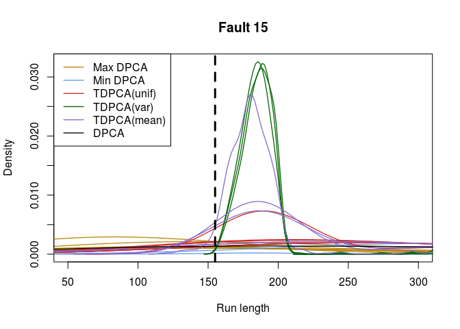

<!-- README.md is generated from README.Rmd. Please edit that file -->
tdpcaTEP
========

An `R` package containing all code to reproduce the TEP data results in the paper "Online Detection of Sparse Changes in High-Dimensional Data Streams Using Tailored Projections". In addition, the package contains the files with the results we obtained in the directories /results and /thresholds. It is also an aim that this package can be used by others who want to test TDPCA for their monitoring tasks, both for bootstrapping thresholds and testing performance in terms of expected detection delays (EDD).

Overview
--------

Functionality:

-   A function to reproduce the entire TEP data study.
-   A function for finding thresholds for TDPCA by non-parametric bootstrapping.
-   Summary and plot functions.

Installation
------------

You can install tdpcaTEP from github with:

``` r
# install.packages("devtools")
devtools::install_github("Tveten/tdpcaTEP")
```

To reproduce figures from our result files, download the folders /results and /thresholds from <https://github.com/Tveten/tdpcaTEP> and put them in your working R directory before running the plot functions.

Exported and documented functions
---------------------------------

For more information, see the documentation of the functions below inside R.

-   TEP\_summary
-   load\_TEP\_data\_globally
-   pfa\_edd\_table
-   rl\_density
-   run\_TEP\_dpca
-   run\_TEP\_sim
-   tdpca\_arl
-   threshold\_finder

The documentation in tpcaMonitoring is helpful to understand the internal functions used in the functions above, as they are more or less the same.

Example
-------

This is a basic example which shows you how to solve a common problem:

``` r
library(tdpcaTEP)
# To run the entire TEP study, use run_TEP_sim().
# It will take a day or two on a regular computer, but the output from it is also contained in
# this package so that one can still get plots of results and study the results in more detail.
# Before running this example code, downloaded
# the results/ and thresholds/ directories from https://github.com/Tveten/tdpcaTEP
# and put them in your working directory.
# The code in run_TEP_sim() specifies in a simple way the simulation
# setup and the necessary steps in the study.

lag <- 5
fault_nr <- 15

# rl_density(lag, fault_nr)
TEP_summary(lag, fault_nr, sort_by = 'edd')
```



    #>                            method   edd   pfa
    #> 27   tpca0.8 semisparse_mean_only  72.7 0.036
    #> 24    tpca0.99 semisparse_sd_only  80.8 0.000
    #> 25   tpca0.995 semisparse_sd_only  83.0 0.000
    #> 26   tpca0.999 semisparse_sd_only  93.5 0.000
    #> 28   tpca0.9 semisparse_mean_only 208.3 0.008
    #> 29  tpca0.95 semisparse_mean_only 234.1 0.006
    #> 15     tpca0.8 semisparse_uniform 240.5 0.000
    #> 16     tpca0.9 semisparse_uniform 313.7 0.000
    #> 17    tpca0.95 semisparse_uniform 324.6 0.000
    #> 1                        max_pca1 332.6 0.312
    #> 30  tpca0.99 semisparse_mean_only 365.9 0.000
    #> 31 tpca0.995 semisparse_mean_only 365.9 0.000
    #> 32 tpca0.999 semisparse_mean_only 365.9 0.000
    #> 33                           dpca 377.1 0.182
    #> 18    tpca0.99 semisparse_uniform 407.6 0.000
    #> 19   tpca0.995 semisparse_uniform 407.6 0.000
    #> 20   tpca0.999 semisparse_uniform 407.6 0.000
    #> 2                        max_pca2 413.1 0.554
    #> 14                      min_pca40 500.2 0.000
    #> 3                        max_pca3 609.6 0.278
    #> 4                        max_pca5 655.7 0.204
    #> 5                       max_pca10 661.3 0.192
    #> 6                       max_pca20 672.3 0.156
    #> 7                       max_pca40 679.5 0.098
    #> 8                        min_pca1 787.7 0.004
    #> 9                        min_pca2 800.0 0.000
    #> 10                       min_pca3 800.0 0.000
    #> 11                       min_pca5 800.0 0.000
    #> 12                      min_pca10 800.0 0.000
    #> 13                      min_pca20 800.0 0.000
    #> 21     tpca0.8 semisparse_sd_only 800.0 0.000
    #> 22     tpca0.9 semisparse_sd_only 800.0 0.000
    #> 23    tpca0.95 semisparse_sd_only 800.0 0.000

    pfa_edd_table()
    #> [1] "Probabilities of false alarms:"
    #>                    min_pca20   tpca0.9 semisparse_uniform 
    #>                        0.000                        0.000 
    #>  tpca0.99 semisparse_sd_only tpca0.9 semisparse_mean_only 
    #>                        0.000                        0.008 
    #>                    max_pca20                         dpca 
    #>                        0.156                        0.182 
    #> [1] "EDD table:"
    #>    Min DPCA TDPCA(unif) TDPCA(var) TDPCA(mean) Max DPCA  DPCA
    #> 1      14.6         7.4        7.4         5.4     17.0   6.2
    #> 2      42.4        22.8       19.7        17.0     25.3  13.9
    #> 3     800.0       769.4      695.5       663.4    668.5 416.7
    #> 4     757.8        20.3        9.6        12.9    127.9   1.0
    #> 5       2.9         2.0        1.8         2.6     27.0   2.1
    #> 6       1.9         1.2        1.0         1.0     23.3   1.0
    #> 7       5.1         2.6        2.7         1.9      9.8   1.0
    #> 8      49.0        24.7       24.2        20.0     40.7  23.0
    #> 9     800.0       766.4      695.6       661.8    663.4 401.6
    #> 10     45.0        28.6       25.0        24.6    317.0 158.0
    #> 11    308.0        24.0       16.3        18.6    635.9   9.2
    #> 12      9.1         7.8        7.3         7.8     34.6   9.1
    #> 13     81.7        47.2       43.3        39.6     61.6  45.5
    #> 14     54.2        27.0       22.4        20.1      9.7   2.3
    #> 15    800.0       313.7       80.8       208.3    672.3 377.1
    #> 16     31.5        17.7       16.3        15.5    603.4 219.3
    #> 17     44.9        36.4       34.5        33.5     46.5  35.0
    #> 18     60.4        51.6       48.7        48.0     73.8  51.6
    #> 19    723.2        14.6       13.5         9.8    692.1  19.1
    #> 20     52.9        43.5       38.4        40.0    505.0  48.2
